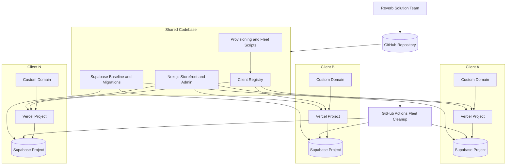
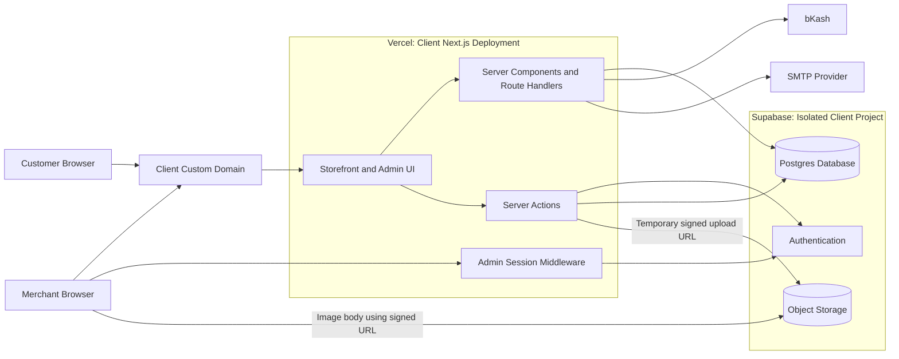
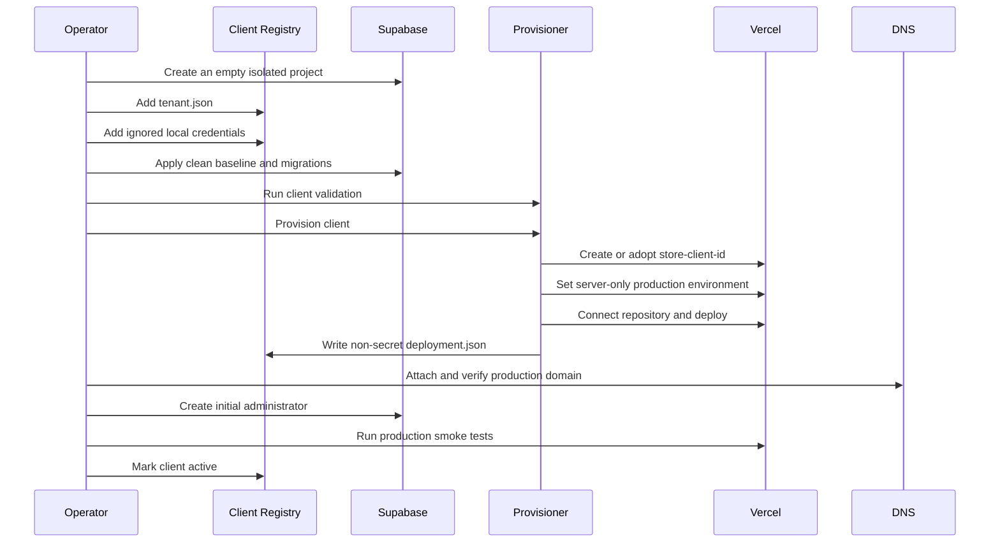
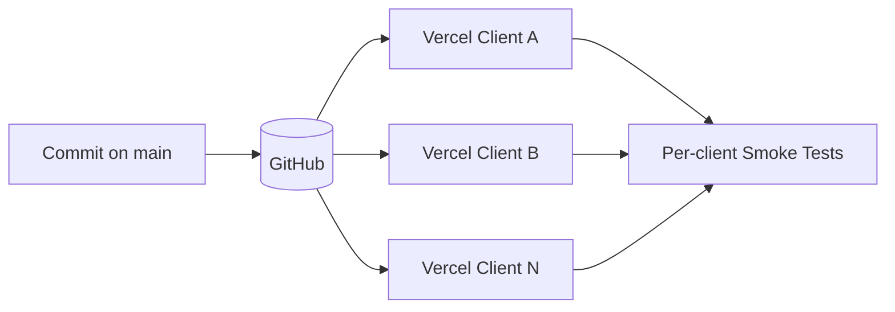
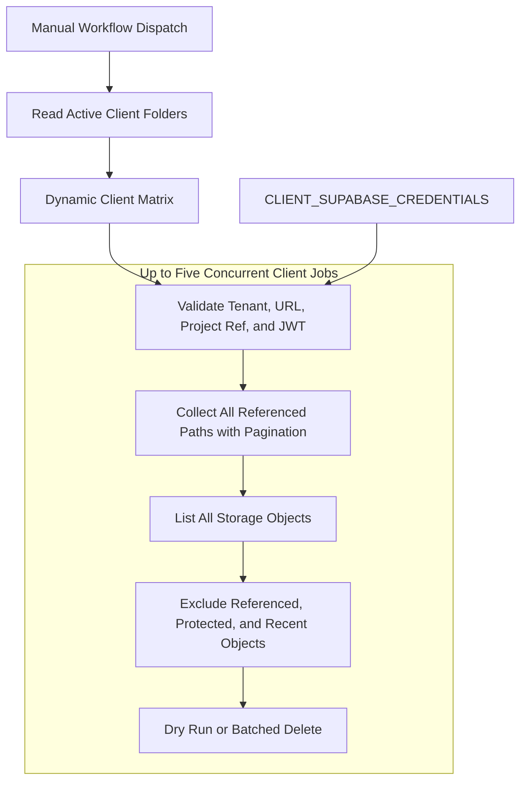

# Platform Architecture

## Overview

The platform uses one shared application repository while giving every client
an isolated production deployment and isolated Supabase project.



This model provides:

- One codebase and one production branch.
- One Vercel project per client.
- One Supabase database, authentication service, and storage account per client.
- One custom domain and independent environment configuration per client.
- The complete product feature set for every client.
- Fleet-wide automation without sharing client business data.

## Repository Structure

```text
frontend/website/                 Shared Next.js storefront and admin panel
backend/clients/<client-id>/      Non-secret tenant and deployment metadata
backend/scripts/                  Provisioning, validation, status, and cleanup
backend/supabase/                 Database baseline and migrations
ops/schemas/                      Tenant manifest schema
.github/workflows/                Fleet automation
.client-secrets/                  Ignored local provisioning credentials
doc/                              Architecture and operations documentation
```

## Per-Client Runtime

The browser communicates with the Next.js deployment. Supabase credentials are
server-only and are not included in browser bundles.



### Runtime Security Boundary

| Location | Data | Tracked by Git |
| --- | --- | --- |
| `tenant.json` | Domain, project reference, schema version | Yes |
| `deployment.json` | Vercel and Supabase deployment metadata | Yes |
| `.client-secrets/<client-id>.env` | Supabase keys used for provisioning | No |
| `frontend/website/.env.<client-id>` | Local client runtime environment | No |
| Vercel environment | Production Supabase keys and site configuration | No |
| GitHub Actions secret | Cleanup service-role keys by client ID | No |
| Browser runtime | UI code and temporary signed upload URLs | No permanent keys |

The anon key and service-role key are server-only environment variables. The
service-role client bypasses row-level security and must only be used by trusted
server code. Admin authentication uses server actions and cookie-bound sessions.

## Client Onboarding

Required input is documented in
[`NEW-CLIENT-DEPLOYMENT.md`](./NEW-CLIENT-DEPLOYMENT.md).



The provisioning script derives the Vercel project name as
`store-<client-id>`, uses `frontend/website` as the project root, deploys from
`main`, and records the resulting non-secret deployment metadata.

## Deployment Flow



All Vercel projects build the same source code. Client differences come from
the tenant's environment, database content, branding, domain, payment settings,
email settings, and merchant-managed configuration.

## Fleet Asset Cleanup

The cleanup workflow scales across the client registry without placing
credentials in its matrix payload.



Cleanup safety rules:

- Only clients with `status: active` are discovered.
- At most five clients run concurrently.
- One failed client does not stop other clients.
- Credentials are validated against the client's Supabase project reference.
- Reference queries paginate to the exact row count.
- Required query, storage listing, and deletion errors fail the client job.
- Files newer than 24 hours are protected from deletion.
- Seed assets under protected prefixes are never deleted.
- Dry-run mode is the default.

## Scaling Model

Adding a client adds one registry folder, one Vercel project, and one Supabase
project. It does not add a source branch or application copy. The dynamic
cleanup matrix supports up to GitHub Actions' matrix limit and limits active
load with `max-parallel: 5`.

Application fixes are made once in the shared codebase and deployed across the
fleet. Database changes are delivered through versioned migrations and tracked
per client using the manifest's `schemaVersion`.
